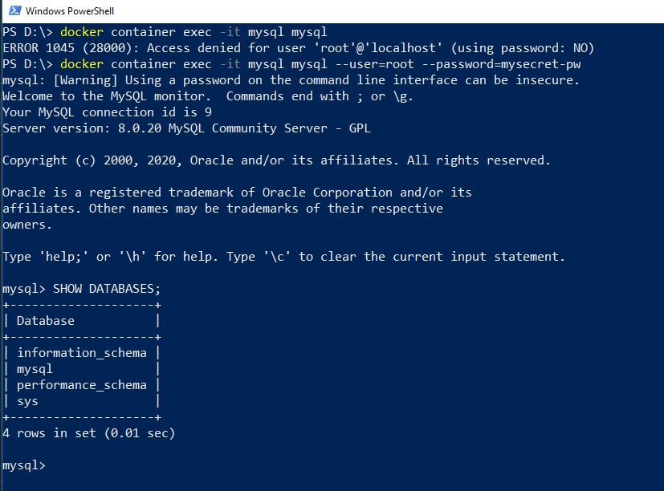

# docker-volume-on-windows
Running a database as Docker Volumes on WIndows Host

#### Creating Database on Windows

### Runnign MSSQL 2016 Express in a Container

First, pull an mssql windows express image from docker hub using the following command,

    docker pull microsoft/mssql-server-windows-express

NOTE: MSSQL 2016 here I shown is using Windows containers. You may need to change in the Docker Settings as `Switch to Windows Containers` if you get any error while running an image.

Once, it's downloaded run a mssql server inside container,

    docker container run -d -p 1433:1433 --name my_mssql --env 'ACCEPT_EULA=Y' --env sa_password=pass!w0rd123 microsoft/mssql-server-windows-express

In the above command, we are mapping port 1433 of sql server from container port to host machine port, giving it a friendly name as my_mssql, passing environment variables for accepting aggrement`(End User Licenseing Aggrement)` and password for sa user as password.

You will see password calidation failed when you check for a running container.

NOTE: You will see a container not running after this, as password is not following default password policy for SQL server. By default, the password must be at least 8 characters long and contain characters from three of the following four sets: Uppercase letters, Lowercase letters, Base 10 digits, and Symbols. You can examine the error log by executing the docker logs command.

Then change a password from the above command and also I am attaching 

    docker container run -d -p 1433:1433 --name sql01 -e sa_password=pass!w0rd123 -e ACCEPT_EULA=Y microsoft/mssql-server-windows-express

Now check that a container is in running state using the command, 

    docker container ps

And, check the logs of the cotnainer

    docker container logs [container_id/container_name]

Then you can use SQL Server Management Studio(SSMS) to connect to this running mssql container. You can check the ip using ipconfig command and try connecting with above credentials.

Use the below command to execute a command inside a container,

    docker exec container_id ipconfig

### Running MySQL in a container

NOTE: MySQL here I shown is using Linux containers. You may need to change in the Docker Settings as `Switch to Linux Containers` if you get any error while running an image.

Run the following command to run mysql inside a container, 

    docker container run -d --name mysql -e MYSQL_ROOT_PASSWORD=mysecret-pw mysql

Check the logs of the container that will verify that mysql is initialized.

    docker container logs container_id

Try getting a mysql client shell inside the container, 

    docker container exec -it mysql mysql
    ERROR 1045 (28000): Access denied for user 'root'@'localhost' (using password: NO)

Looks like we have access denied and that is because we need to pass username and password.

    docker container exec -it mysql mysql --user=root --password=mysecret-pw

Now, come out of the client shell using `exit` command.

Stop the running mysql conainer using,

    docker container stop mysql

Check the avaiable volumes on the host machine,

    PS D:\> docker volume ls
    DRIVER              VOLUME NAME
    local            269c885a34d9bedd5df7f98a9c20f8418f1db5f34f1a45bd4d70ba510bcfad4a

So databases containers create volumes along with containers. Databases have special considerations for storing their data and data is written to volumes on disk because the layer file system docker images consist of with read/write layer on top for the container, is not a performant way for storing data something like a database. Especially when a database uses memory mapped files, which are pretty common. Hence, we use volumes for the same.

NOTE: In case of mysql container we did not specify a volumes while running docker cotnainer run. This was created because if you take a look at mysql docker hub image latest tag and check it's Dockerfile you will see a VOLUME instruction as shown in [docker-library/mysql](https://github.com/docker-library/mysql/blob/bc6e37a2bed792b1c4fc6ab1ec3ce316e6a5f061/8.0/Dockerfile#L77). And, whena VOLUME is specify within image it will mark a certain path inside of the image to be created as an external volume outside of file system for the container.And, then that volume is created on the host and gets mounted much like a host mount.

Volumes will remain on the system even if we remove a container.

Now, give a friendly name to a volume, named volume using the following command, here, it will re-use the volume which was already created,

     docker container run -d --name mysql -e MYSQL_ROOT_PASSWORD=mysecret-pw -v db:/var/lib/mysql mysql

Check the volume db is created,

    PS D:\> docker volume ls
    DRIVER              VOLUME NAME
    local               269c885a34d9bedd5df7f98a9c20f8418f1db5f34f1a45bd4d70ba510bcfad4a
    local               db

Then, get a mysql client shell using the exec command,

    docker container exec -it mysql mysql --user=root --password=mysecret-pw

Now create a databses and a table as shown below,

    CREATE DATABASE users;
    USE users;
    CREATE TABLE employee (fname varchar(255), lname varchar(255), emp_id int);

Now exit out of container, stop and delete a container and create a new container using the same volume as db, you will see your data is still persistent inside a container.

